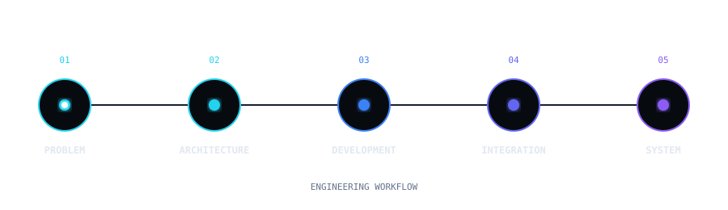

<div align="center">

# THAYNA NUNES

### SOFTWARE ENGINEER · FULL STACK

`ARCHITECTURE` · `SYSTEMS INTEGRATION` · `AUTOMATION` · `AI`

<p align="center">
  
</p>

`● SYSTEM ONLINE`

</div>

</br>

## `> SOBRE_MIM`

```text
Sou Engenheira de Software com foco no desenvolvimento de sistemas
reais, atuando desde experiências frontend até serviços backend,
APIs, integrações e automações.

Atuo principalmente com Desenvolvimento Full Stack, Arquitetura de
Software, Integração de Sistemas, Automação de Processos e
Inteligência Artificial.

Minha abordagem começa pela compreensão do problema, seguida pelo
desenho da solução e pela construção de software organizado,
manutenível, escalável e útil para o negócio.

```

</br>

## `> COMO_EU_CONSTRUO`

<div align="center">



</div>

<br />

## `> TECNOLOGIAS`

### Frontend

<p>
  
</p>

### Backend

<p>
  
</p>

### Banco de Dados

<p>
  
</p>

### Inteligência Artificial & Automação

<p>
  
</p>

### Ferramentas & Infraestrutura

<p>
  
</p>

<br />

## `> ENGINEERING_STACK`

<div align="center">

<table>
<tr>

<td width="20%" align="center">

### FRONTEND

React  
Next.js  
TypeScript  
JavaScript  
Tailwind CSS  

</td>

<td width="20%" align="center">

### BACKEND

Node.js  
NestJS  
Python  
FastAPI  
REST APIs  

</td>

<td width="20%" align="center">

### DATA

PostgreSQL  
MySQL  
MongoDB  
Prisma  
SQL  

</td>

<td width="20%" align="center">

### AI

TensorFlow  
OpenCV  
Computer Vision  
Machine Learning  

</td>

<td width="20%" align="center">

### AUTOMATION

APIs  
Webhooks  
n8n  
Process Automation  
Integrations  

</td>

</tr>
</table>

</div>

<br />

## `> SYSTEM_CAPABILITIES`

<div align="center">

<table>
<tr>

<td width="33%" align="center">

### ◈

### CONSTRUIR

Aplicações web completas, do frontend ao backend, conectando interfaces, regras de negócio, APIs e dados.

</td>

<td width="33%" align="center">

### ◇

### INTEGRAR

Conectar sistemas, serviços e APIs para transformar diferentes componentes em um fluxo único.

</td>

<td width="33%" align="center">

### ◎

### AUTOMATIZAR

Transformar processos manuais em fluxos digitais mais eficientes, rastreáveis e escaláveis.

</td>

</tr>

<tr>

<td width="33%" align="center">

### ◉

### ANALISAR

Utilizar dados, processamento e inteligência artificial para apoiar decisões e classificação automatizada.

</td>

<td width="33%" align="center">

### △

### EVOLUIR

Projetar sistemas preparados para manutenção, novas integrações e expansão de funcionalidades.

</td>

<td width="33%" align="center">

### ∞

### RESOLVER

Partir de problemas reais e transformá-los em soluções de software aplicáveis ao negócio.

</td>

</tr>

</table>

</div>

<br />

## `> ENGENHARIA`

<div align="center">

<table>
<tr>

<td width="25%" valign="top">

<div align="center">

### `01`

### FULL STACK

</div>

Construção de aplicações completas, conectando interfaces, APIs, regras de negócio e persistência de dados.

<br />

`Frontend`  
`Backend`  
`REST APIs`  
`Database`

</td>

<td width="25%" valign="top">

<div align="center">

### `02`

### ARQUITETURA

</div>

Estruturação de sistemas com foco em organização, manutenção, integração e evolução.

<br />

`Architecture`  
`Design Patterns`  
`Scalability`  
`Maintainability`

</td>

<td width="25%" valign="top">

<div align="center">

### `03`

### INTEGRAÇÃO

</div>

Conexão entre APIs, serviços e diferentes sistemas para construir fluxos digitais integrados.

<br />

`REST APIs`  
`Services`  
`Webhooks`  
`Integrations`

</td>

<td width="25%" valign="top">

<div align="center">

### `04`

### IA & AUTOMAÇÃO

</div>

Aplicação de inteligência artificial, visão computacional e automação para resolver processos reais.

<br />

`AI`  
`Computer Vision`  
`Automation`  
`Machine Learning`

</td>

</tr>
</table>

</div>

<br />

## `> PROJETOS_EM_DESTAQUE`

<table>
<tr>

<td width="33%" valign="top">

<div align="center">

### 🚚

### FREIGHT OPERATIONS

`LOGISTICS PLATFORM`

</div>

---

**Problema**

Gestão de operações de frete envolvendo programação, cotação, negociação, transportadoras e acompanhamento operacional.

**Sistema**

- Fluxos logísticos
- Regras de negócio
- Interfaces corporativas
- Integração de perfis

**Stack**

`React` `TypeScript` `Node.js`

<div align="center">

<a href="SEU_LINK_DO_CASE_FREIGHT">
  
</a>

</div>

</td>

<td width="33%" valign="top">

<div align="center">

### 👁️

### AI VISION

`COMPUTER VISION`

</div>

---

**Problema**

Automação da classificação de imagens capturadas durante um processo operacional.

**Sistema**

- Captura de imagens
- Processamento por IA
- Classificação automática
- API de feedback
- Relatórios

**Stack**

`Python` `TensorFlow` `OpenCV`

<div align="center">

<a href="SEU_LINK_DO_CASE_AI_VISION">
  
</a>

</div>

</td>

<td width="33%" valign="top">

<div align="center">

### 📄

### DOCUMENT AI

`DOCUMENT AUTOMATION`

</div>

---

**Problema**

Automação do processamento de documentos e transformação de informações não estruturadas em dados organizados.

**Sistema**

- OCR
- Extração de informações
- Validação
- Estruturação de dados
- Automação

**Stack**

`Python` `OCR` `APIs`

<div align="center">

<a href="SEU_LINK_DO_CASE_DOCUMENT_AI">
  
</a>

</div>

</td>

</tr>
</table>

</br>

## `> FOCO_ATUAL`

```text
$ status

[SISTEMA] Perfil profissional ativo
[FOCO] Engenharia de Software

$ atualmente_estudando

→ Arquitetura de Software
→ Desenvolvimento Full Stack
→ Inteligência Artificial
→ Integração de Sistemas
→ Automação de Processos

$ objetivo

Construir sistemas bem estruturados, integráveis e escaláveis,
transformando problemas reais de negócio em soluções de software.
```

</br>

## `> CONECTE_SE`

<div align="center">

<a href="SEU_LINK_DO_PORTFOLIO">
  
</a>

<a href="https://www.linkedin.com/in/thayna-nunes-alvarenga">
  
</a>

<a href="mailto:thaynanunes385@gmail.com">
  
</a>

<a href="https://github.com/ThaynaAlvarenga">
  
</a>

</div>

---

<div align="center">


### `SYSTEM STATUS: ONLINE`


<br><br>

`BUILD` · `INTEGRATE` · `AUTOMATE` · `INNOVATE`

<br><br>

<sub>
Transformando problemas reais em sistemas de software.
</sub>

</div>

