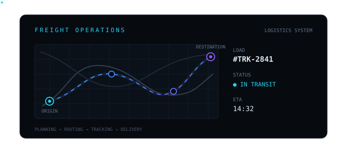
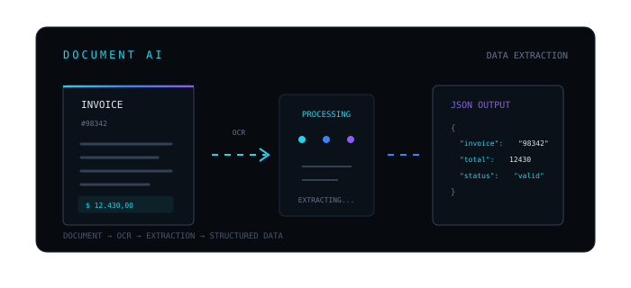
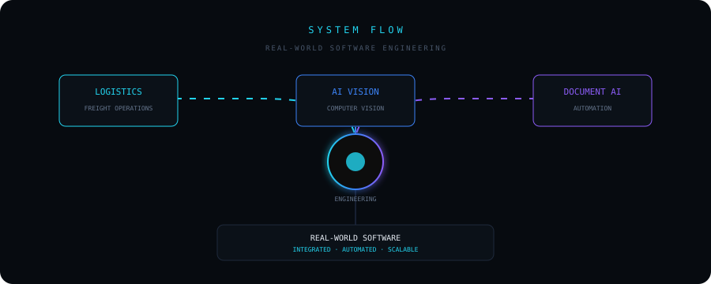

<!--
-->

<div align="center">

# THAYNA NUNES

### SOFTWARE ENGINEER · FULL STACK

`ARCHITECTURE` · `SYSTEMS INTEGRATION` · `AUTOMATION` · `AI`

<p align="center">
  
</p>



`● SYSTEM ONLINE`

</div>

<br />

## `> SOBRE_MIM`

```text
Desenvolvedora Full Stack com mais de 4 anos de experiência,
atuando como PJ desde 2022 na condução de projetos do zero à
entrega da arquitetura à implementação em produção.

Trabalho diretamente com clientes para traduzir necessidades de
negócio em soluções técnicas: aplicações web, integrações entre
sistemas via API, automação de processos com n8n e Make, e
dashboards analíticos em Power BI para apoiar decisões.

Perfil autônomo e analítico, com hábito de aprendizado contínuo
e comunicação clara inclusive em espanhol fluente, o que já
foi decisivo em projetos com integrações internacionais.
```

<details>
<summary>🇺🇸 <b>Read in English</b></summary>

```text
Full Stack Developer with 4+ years of experience, working as an
independent contractor since 2022, leading projects end to end
from architecture to production deployment.

I work directly with clients to translate business needs into
technical solutions: web applications, API-based system
integrations, process automation with n8n and Make, and Power BI
analytics dashboards to support decision-making.

Autonomous and analytical profile, with a habit of continuous
learning and clear communication including fluent Spanish,
which has been decisive in projects involving international
integrations.
```

</details>

<br />

## `> COMO_EU_CONSTRUO`

<div align="center">


</div>

<br />

## `> TECNOLOGIAS`

### Linguagens

<p>
  
</p>

### Frontend

<p>
  
</p>

### Backend

<p>
  
</p>

### Dados & BI

<p>
  
  
</p>

### Integração & Automação

<p>
  
  
  
  
</p>

### Ferramentas & Metodologias

<p>
  
</p>
<p>
  
  
  
  
</p>

<br />

## `> ENGINEERING_STACK`

<div align="center">

<table>
<tr>

<td width="20%" align="center">

### FRONTEND

React
Next.js
TypeScript
JavaScript
Tailwind CSS

</td>

<td width="20%" align="center">

### BACKEND

Node.js
NestJS
Python
FastAPI
REST APIs

</td>

<td width="20%" align="center">

### DATA

PostgreSQL
MySQL
Firebase
Power BI
SQL

</td>

<td width="20%" align="center">

### AI

TensorFlow
OpenCV
Computer Vision
Machine Learning

</td>

<td width="20%" align="center">

### AUTOMATION

n8n
Make
Webhooks
APIs
Integrations

</td>

</tr>
</table>

</div>

<br />

## `> SYSTEM_CAPABILITIES`

<div align="center">

<table>
<tr>

<td width="33%" align="center">

### ◈

### CONSTRUIR · BUILD

Aplicações web, mobile e desktop do zero à produção, com foco em escalabilidade e usabilidade.
<br />
<sub><i>Web, mobile and desktop applications from zero to production, focused on scalability and usability.</i></sub>
<br />
</td>

<td width="33%" align="center">

### ◇

### INTEGRAR · INTEGRATE

APIs REST e comunicação entre sistemas heterogêneos, unindo diferentes plataformas em um fluxo único.
<br />
<sub><i>REST APIs and communication across heterogeneous systems, unifying different platforms into one flow.</i></sub>
<br />
</td>

<td width="33%" align="center">

### ◎

### AUTOMATIZAR · AUTOMATE

Fluxos operacionais automatizados com n8n e Make, reduzindo retrabalho manual mensurável.
<br />
<sub><i>Operational flows automated with n8n and Make, measurably reducing manual rework.</i></sub>
<br />
</td>

</tr>

<tr>

<td width="33%" align="center">

### ◉

### ANALISAR · ANALYZE

Dashboards analíticos em Power BI para apoiar decisões de negócio com dados reais.
<br />
<sub><i>Power BI analytics dashboards to support business decisions with real data.</i></sub>
<br />
</td>

<td width="33%" align="center">

### △

### EVOLUIR · EVOLVE

Arquitetura pensada para manutenção, novas integrações e crescimento não só para o dia 1.
<br />
<sub><i>Architecture designed for maintenance, new integrations and growth not just day one.</i></sub>
<br />
</td>

<td width="33%" align="center">

### ∞

### RESOLVER · SOLVE

Condução de projetos do zero à entrega, do levantamento de requisitos à produção.
<br />
<sub><i>Leading projects end to end, from requirements gathering to production.</i></sub>
<br />
</td>

</tr>

</table>

</div>

<br />

## `> FEATURED_CASES`

<div align="center">

<table>
<tr>

<td width="33%" valign="top">

<div align="center">



### FREIGHT OPERATIONS

`LOGISTICS`

Plataforma para gerenciamento de operações logísticas, conectando processos, transportadoras e acompanhamento operacional.
<br />
<sub><i>Platform for logistics operations management, connecting processes, carriers and operational tracking.</i></sub>

<br /><br />

`React` · `TypeScript` · `Node.js` · `REST APIs` · `PostgreSQL`

<br />

<a href="https://thaynanunes-portfolio.vercel.app/projetos/freight-operations-management">
  
</a>

</div>

</td>

<td width="33%" valign="top">

<div align="center">



### AI VISION

`COMPUTER VISION`

Sistema de classificação de imagens com IA e visão computacional atuação focada na integração e evolução dos módulos do sistema.
<br />
<sub><i>AI-powered image classification system with computer vision focused on integrating and evolving the system's modules.</i></sub>

<br /><br />

`Python` · `TensorFlow` · `OpenCV` · `FastAPI` · `SQLAlchemy`

<br />

<a href="https://thaynanunes-portfolio.vercel.app/projetos/ai-vision">
  
</a>

</div>

</td>

<td width="33%" valign="top">

<div align="center">



### DOCUMENT AI

`AUTOMATION`

Sistema para processamento e estruturação automatizada de documentos e informações (OCR, extração, validação).
<br />
<sub><i>Automated document processing and structuring system (OCR, extraction, validation).</i></sub>

<br /><br />

`Python` · `OCR` · `APIs` · `Automation`

<br />

<a href="https://thaynanunes-portfolio.vercel.app/projetos/intelligent-document-processing">
  
</a>

</div>

</td>

</tr>
</table>

</div>

<br />

<div align="center">



</div>

<br />

<div align="center">

<sub>
📦 <b>Outro projeto público</b> · <b>Other public project</b> — <a href="https://github.com/ThaynaAlvarenga/promocoes"><code>ThaynaAlvarenga/promocoes</code></a><br />
Plataforma Full Stack de promoções do comércio local (TCC) — React, Node.js, Express, MongoDB, JWT, Cloudinary.<br />
<i>Full Stack local-commerce promotions platform (capstone project) — React, Node.js, Express, MongoDB, JWT, Cloudinary.</i>
</sub>

</div>

<br />

## `> FORMAÇÃO`

```text
🎓 Ciência da Computação
   2026 – 2028 · em andamento

🎓 Tecnologia em Análise e Desenvolvimento de Sistemas
   2022 – 2025 · concluído · Faculdade Eduvale de Avaré
```

<details>
<summary>🇺🇸 <b>Read in English</b></summary>

```text
🎓 Computer Science
   2026 – 2028 · in progress

🎓 Systems Analysis and Development (Technology degree)
   2022 – 2025 · completed · Faculdade Eduvale de Avaré
```

</details>

<br />

## `> IDIOMAS`

🇧🇷 Português — nativo · 🇺🇸 Inglês — intermediário · 🇪🇸 Espanhol — fluente

<sub><i>🇧🇷 Portuguese — native · 🇺🇸 English — intermediate · 🇪🇸 Spanish — fluent</i></sub>

<br />

## `> FOCO_ATUAL`

```text
$ status

[SISTEMA] Perfil profissional ativo
[FOCO] Engenharia de Software

$ atualmente_estudando

→ Arquitetura de Software
→ Inteligência Artificial aplicada
→ Integração de sistemas em maior escala
→ Soluções de Cibersegurança

$ objetivo

Aprofundar arquitetura de sistemas e IA aplicada,
seguindo com projetos que unam automação, dados e produto real.
```

<details>
<summary>🇺🇸 <b>Read in English</b></summary>

```text
$ status

[SYSTEM] Active professional profile
[FOCUS] Software Engineering

$ currently_studying

→ Software Architecture
→ Applied Artificial Intelligence
→ Systems integration at larger scale

$ goal

Deepening systems architecture and applied AI,
continuing with projects that combine automation, data and real products.
```

</details>

<br />

## `> CONECTE_SE`

<div align="center">

<a href="https://www.linkedin.com/in/thayna-nunes-alvarenga/" target="_blank">
  
</a>

<a href="mailto:thaynanunes385@gmail.com">
  
</a>

<a href="https://github.com/ThaynaAlvarenga" target="_blank">
  
</a>

</div>

<br />

<div align="center">

```text
> CONNECTION_STATUS

[●] GITHUB        ONLINE
[●] LINKEDIN      AVAILABLE
[●] COLLABORATION OPEN

SYSTEM READY
```

---

<br />


<br />

### `BUILD · INTEGRATE · AUTOMATE · EVOLVE`

<sub>
Software Engineering · Full Stack Development · AI · Systems Integration
</sub>

<br />
<br />

<sub>
© Thayna Nunes · Software Engineer
</sub>

</div>